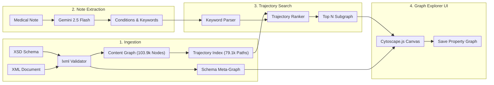
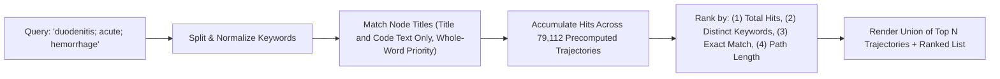
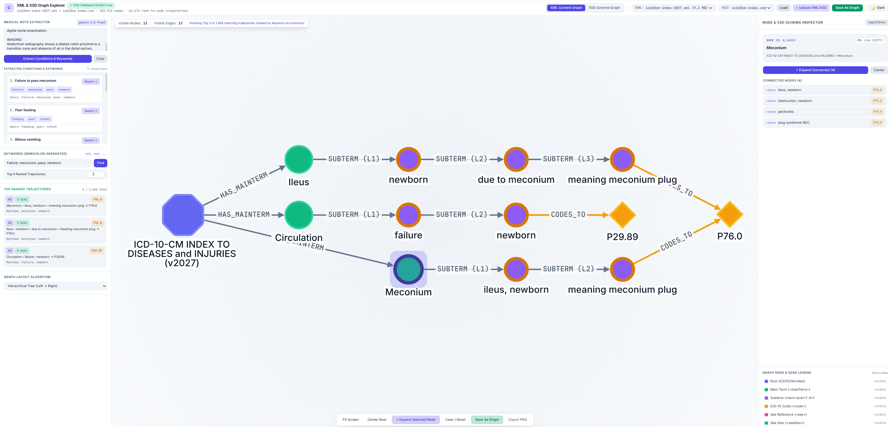

# Medical Coding Based on Gemini & ICD-10-CM Interactive Graph Explorer


An interactive web application that loads an **XML Document** (`xml_documents/icd10cm-index-2027.xml`) and an **XML Schema** (`xml_schemas/icd10cm-index.xsd`), validates the document against the schema, builds a schema-guided **Property & Knowledge Graph**, extracts clinical conditions and search keywords from unstructured medical notes using **Gemini 2.5 Flash**, and ranks **root-to-code trajectories** interactively.


## System Architecture & Clinical Coding Workflow



## Key Features

### 1. XSD Schema Validation & Meta-Graph Construction (`app/graph_engine.py`)
- Validates the XML document against the XSD schema using `lxml.etree.XMLSchema`.
- Parses `<xsd:element>`, `<xsd:complexType>`, `<xsd:group>`, `<xsd:attribute>`, and `<xsd:restriction>` definitions to classify XML elements into:
  - **Complex Entity Nodes** (`ICD10CM.index`, `mainTerm`, `term`)
  - **Inline Modifiers** (`title`, `nemod`, `version`)
  - **Semantic Reference / Shared Value Nodes** (`code`, `see`, `seeAlso`, `manif`, `seecat`, `subcat`)
- Builds an interactive **XSD Schema Graph** showing element hierarchy, reusable model groups (`termGroup`, `addend`), attributes (`@level`, `@col`, `@isAddenda`), and edge cardinalities (`1..*`, `0..1`, `choice`).

### 2. Schema-Guided XML Content Graph & Trajectory Index
- Indexes **103,912 graph nodes** and **79,112 root-to-code trajectories** from `icd10cm-index-2027.xml` in ~3 seconds.
- Bypasses intermediate `<letter>` container tags so all `<mainTerm>` nodes attach directly to the root `ICD10CM.index` (`n_0`) node (`ICD10CM.index` → `mainTerm` → recursive `term` levels `1..9` → `code`).
- Connects **shared ICD-10 Code Hubs** (`code:Q27.8`, `code:I10`, etc.) and **cross-reference edges** (`SEE` and `SEE_ALSO`) across branches so users can discover all index terms mapping to the same diagnosis code or cross-referenced concept.

### 3. Medical Note Condition & Keyword Extractor (`POST /api/extract-conditions`)
- Located in the **Left Sidebar**, the **Medical Note Extractor** accepts free-text clinical notes and calls **Gemini 2.5 Flash** (`gemini-2.5-flash`) via the `google-genai` SDK using structured JSON output (`ExtractedConditionsOutput`).
- Automatically identifies every clinical condition, diagnosis, or finding in the note and decomposes each into an ordered list of atomic ICD-10-CM index search keywords:
  - Excludes English stopwords.
  - Retains modifiers, anatomical sites, acuity/chronicity, etiology, and directly linked secondary conditions as keywords on the primary condition.
  - Separates unlinked co-existing conditions into independent condition entries.
- Clicking **Search →** on any extracted condition card copies its semicolon-separated keywords (`kw1; kw2; ...`) into the search box and immediately triggers a ranked trajectory search on the graph.

### 4. Multi-Keyword Trajectory Search & Ranking (`GET /api/search`)
Instead of returning disconnected node matches, the search engine evaluates complete **root-to-code trajectories** (`n_0` → `mainTerm` → `term` → `code`):



- **Title-Focused Whole-Word Matching**:
  - Evaluates keywords against node `<title>` and `<code>` text while excluding parenthetical `<nemod>` non-essential modifiers and the root node (`n_0`).
  - Uses word-boundary regular expressions (`\b...\b`) whenever whole-word matches exist in the index, falling back to substring matching only when a keyword has zero whole-word matches.
- **5-Tier Trajectory Ranking Formula**:
  1. **Total keyword occurrences** summed across all nodes in the trajectory (descending).
  2. **Distinct query keywords matched** along the trajectory (descending).
  3. **Exact node title/code matches** along the trajectory (descending).
  4. **Shorter trajectory length** (ascending depth from root to code).
  5. **XML document order** tie-breaker.
- **Top `N` Control & Interactive Trajectory Isolation**:
  - Adjust **Top N Ranked Trajectories** (`1` to `500`, default `10`) to control how many top-ranked trajectories are merged into the displayed subgraph.
  - **Click a Ranked Trajectory Card** in the left sidebar to isolate that single root-to-code path on the canvas and inspect its terminal node.
  - **Click Any Node on the Canvas** during an active search to isolate only the trajectory(ies) passing through that node; click the root node (`n_0`), the canvas background, or **Show All Top N Trajectories** to restore the full Top N subgraph.



### 5. Interactive Visualization (`app/static/index.html`)
- **Three-Column Workspace**:
  - **Left Sidebar**: Medical Note Extractor (`gemini-2.5-flash`), Semicolon-Separated Keyword Search & Top `N` selector, Top Ranked Trajectories list, and Graph Layout Algorithm selector (**Dagre LR/TB**, **CoSE**, **Concentric**, **Breadthfirst**).
  - **Center Canvas**: Interactive **Cytoscape.js** canvas with real-time telemetry (visible nodes/edges, active isolation status), quick action bar (**Fit Screen**, **Center Root**, **+ Expand Selected Node**, **Clear / Reset**, **Save As Graph**, **Export PNG**), and **Dark / Light Mode** switcher.
  - **Right Sidebar**: **Node & XSD Schema Inspector** (displaying XML line numbers, `<nemod>` modifiers, breadcrumbs, and scrollable connected nodes) and the interactive **Graph Node & Edge Legend** (click any node type to filter visibility).
- **Dynamic Graph Expansion**: Double-click any node (or click **+ Expand Connected**) to dynamically fetch and merge its connected children and semantic edges while preserving ancestor hierarchy back to the root node.

### 6. Save As Property Graph (`PG-JSON`, `PG-JSONL`, & `GoogleSQL DDL`)
- Click **Save As Graph** in the top header or bottom action bar to build a formal **ISO/IEC 39075 GQL Labeled Property Graph** (`networkx.MultiDiGraph`) from the currently displayed canvas subgraph, the full XML document, or the XSD schema meta-graph.
- Choose the target directory and file name via the interactive server folder browser or the native OS file-save dialog.
- Supports three graph representations optimized for **LLM comprehension**, **Google Cloud BigQuery Graph**, and **Cloud Spanner Graph**:
  - **Property Graph JSON (`.pg.json` — Default)**: Self-contained document combining an `llm_context` clinical trajectory summary, ready-to-run BigQuery Graph & Spanner Graph `CREATE PROPERTY GRAPH` DDL, and flat primary/foreign-key `nodes` & `edges` collections.
  - **Property Graph JSONL (`.jsonl`)**: Newline-Delimited JSON records (`record_type: "node" | "edge"`) ready for direct `bq load --source_format=NEWLINE_DELIMITED_JSON` and Spanner bulk import.
  - **GoogleSQL Property Graph Script (`.sql`)**: Executable `CREATE TABLE`, batched `INSERT INTO`, and `CREATE OR REPLACE PROPERTY GRAPH` statements.

## Quick Start

1. **Configure Gemini Authentication** (for Medical Note Extraction):
   - Set `GEMINI_API_KEY` (or `GOOGLE_API_KEY`), **or** authenticate with Google Cloud Vertex AI Application Default Credentials (`gcloud auth application-default login` with `GOOGLE_CLOUD_PROJECT`).

2. **Start the Server**:
   ```bash
   .venv/bin/python run.py
   ```

3. **Open the Explorer**:
   Navigate to **http://127.0.0.1:8000** in your browser.
